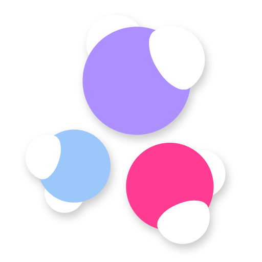
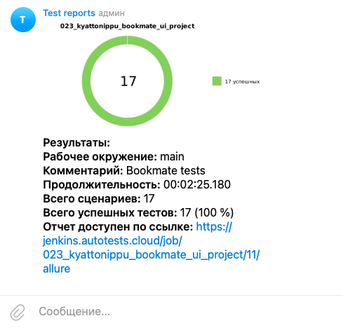

# :books: Проект по автоматизации тестирования для [Bookmate](https://bookmate.ru/)


## :clipboard: Содержание:
- <a href="#tools">Технологии и инструменты</a>
- <a href="#console">Запуск тестов из терминала</a>
- <a href="#jenkins">Запуск сборки в Jenkins</a>
- <a href="#allure">Отчет о результатах тестирования в Allure Report</a>
- <a href="#allureTestOps">Интеграция с AllureTestOps</a>
- <a href="#jira">Интеграция с Jira</a>
- <a href="#telegram">Уведомления в Telegram с использованием бота</a>
- <a href="#selenoid">Пример запуска теста в Selenoid</a>


<a id="tools"></a>
## :computer: Технологии и инструменты
<p  align="center">
  <a href="https://www.jetbrains.com/idea/"></a>
  <a href="https://www.java.com/"></a>
  <a href="https://selenide.org"></a>
  <a href="https://aerokube.com/selenoid/"></a>
  <a href="https://gradle.org"></a>
  <a href="https://junit.org/junit5"></a>
  <a href="https://www.jenkins.io"></a>
  <a href="https://www.docker.com"></a>
  <a href="https://qameta.io/allure-report"></a>
  <a href="https://qameta.io"></a>
  <a href="https://www.atlassian.com/software/jira"></a>
  <a href="https://www.telegram.org"></a>
</p>

> Тесты в данном проекте написаны на языке <code>Java</code> с использованием фреймворка для тестирования <code>Selenide</code>, сборщик - <code>Gradle</code>. <code>JUnit 5</code> задействован в качестве фреймворка модульного тестирования.
При прогоне тестов для запуска браузеров используется <code>Selenoid</code>.
Для удаленного запуска реализована джоба в <code>Jenkins</code> с формированием Allure-отчета и отправкой результатов в <code>Telegram</code> при помощи бота. Так же реализована интеграция с <code>Allure TestOps</code> и <code>Jira</code>.

Содержание Allure-отчета:
- Шаги теста;
- Скриншот страницы на последнем шаге;
- Page Source;
- Логи браузерной консоли;
- Видео выполнения автотеста.


<a id="console"></a>
## :keyboard: Запуск тестов из терминала

### Локальный запуск тестов

```bash
gradle clean test
```

### Удаленный запуск тестов

```bash
gradle clean test 
-Dbrowser=${BROWSER}
-DbrowserVersion=${BROWSER_VERSION}
-DbrowserSize=${BROWSER_SIZE}
-DbaseUrl=${BASE_URL}
-DremoteUrl=${REMOTE_URL}

```
При выполнении данной команды в терминале IDE тесты запустятся удаленно в <code>Selenoid</code>.
> `${BROWSER}` - наименование браузера (_по умолчанию - <code>chrome</code>_).
>
> `${BROWSER_VERSION}` - версия браузера (_по умолчанию - <code>100.0</code>_).
>
> `${BROWSER_SIZE}` - размер окна браузера (_по умолчанию - <code>1920x1080</code>_).
>
>  `${BASE_URL}` - адрес, по которому будет открываться тестируемое приложение.
> 
> `${REMOTE_URL}` - адрес удаленного сервера, на котором будут запускаться тесты.


<a id="jenkins"></a>
##  Запуск сборки в [Jenkins](https://jenkins.autotests.cloud/job/023_kyattonippu_bookmate_ui_project/)

>  Сборка с параметрами позволяет перед запуском изменить параметры для сборки (путем выбора из списка или прямым указанием значения). Для запуска сборки необходимо перейти в раздел <code>Build with parameters</code>, указать значения параметров и нажать кнопку <code><strong>*Build*</strong></code>.

<p align="center">
  
</p>

###  Параметры сборки в Jenkins:
- <code>BROWSER</code>  - браузер, в котором будут выполняться тесты
- <code>URL</code> - адрес основной страницы тестируемого сайта
- <code>VERSION</code> - версия браузера, в которой будут выполняться тесты. Реализован запуск в Firefox на версиях 98.0 и 97.0, а также Chrome 99.0 и 100.0 )
- <code>SIZE</code> -  размер окна браузера, в котором будут выполняться тесты.
- <code>TASK</code> - набор тестов для запуска

>  После выполнения сборки, в блоке <code><strong>*История сборок*</strong></code> напротив номера сборки появится
значки <code><strong>*Allure Report*</strong></code> и <code><strong>*AllureTestOps*</strong></code>, при клике на которые откроется страница со сформированным html-отчетом и тестовой документацией соответственно.


<a id="allure"></a>
##  Отчет о результатах тестирования в [Allure Report](https://jenkins.autotests.cloud/job/023_kyattonippu_bookmate_ui_project/allure/)

<p align="center">
  
</p>

<p align="center">
  
</p>


<a id="allureTestOps"></a>
##  Интеграция с [Allure TestOps](https://allure.autotests.cloud/project/3961/dashboards)
> На странице *Dashboard* в <code>Allure TestOps</code> видна статистика количества тестов: сколько из них добавлены и проходятся вручную, сколько автоматизированы. Новые тесты, а так же результаты прогона приходят по интеграции при каждом запуске сборки.

<p align="center">

</p>

> Во вкладке <code>Test Cases</code> представлены все существующие тест-кейсы, отсортированные по сьютам, с подробным описанием, шагами воспроизведения, тегами, историей.

<p align="center">

</p>


<a id="jira"></a>
##  Интеграция с [Jira](https://jira.autotests.cloud/browse/HOMEWORK-1046)

> Реализована интеграция <code>Allure TestOps</code> с <code>Jira</code>, в тикете отображается, какие тест-кейсы были написаны в рамках задачи и результат их прогона.

<p align="center">
  
</p>


<a id="telegram"></a>
##  Уведомления в Telegram с использованием бота

> После завершения сборки специальный бот, созданный в <code>Telegram</code>, автоматически обрабатывает и отправляет сообщение с отчетом о прогоне тестов.

<p align="center">

</p>


<a id="selenoid"></a>
##  Пример запуска теста в Selenoid

> В отчетах <code>Allure Report</code> для каждого теста прикреплен не только скриншот, но и видео прохождения теста
> 
<p align="center">
  
</p>
